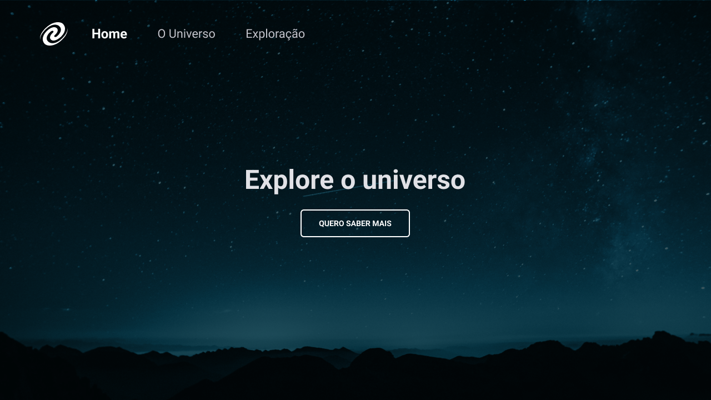
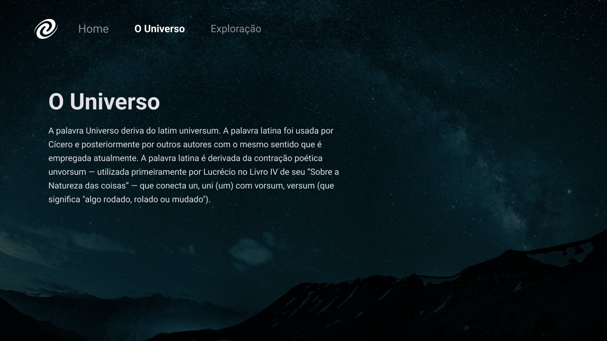

<strong><h1 align="center">SPA Universe</h1></strong>

Mais um desafio concluído com sucesso! Esse é o primeiro desafio do stage 6 - trilha Explorer da Rocketseat. Feito totalmente do zero a partir de um layout do figma, nele eu pude colocar em prática vários novos conceitos adquiridos no stage 6. Para fazer esse desafio eu usei :

- Conceitos de SPA;
- Mapeamento de rotas;
- Assíncrono e promisses;
- Orientação a objetos;
- Classes e muito mais.

Também aprendi a criar um servidor local simples com NodeJs.

## 🎨 Layout

O layout do projeto está disponível no [Figma](https://www.figma.com/design/6sSLcHiNYk3lWygL0oEQFE/%5BDesafios-Explorer%5D-SPA-Universe-(Copy)?node-id=30-1155&node-type=frame&t=EsjF3uNNM8oac9l2-0)

  
  

## 🚀 Tecnologias

Esse projeto foi desenvolvido com as seguintes tecnologias:

- HTML e CSS
- JavaScript
- Git e Github
- Figma
- node

## 🚀 Pré-requisitos

Antes de começar, você vai precisar ter instalado em sua máquina as seguinte ferramenta:

Feito com ♥ by [Gelzieny](https://gelzieny.dev)

